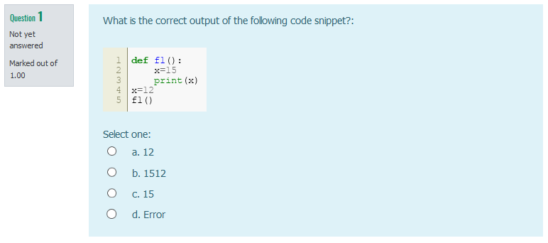

# Gift Snippet

The [GIFT format](https://docs.moodle.org/311/en/GIFT_format) allows for managing student questions for learning management systems within text files. Integrating images requires a rather cumbersome approach by using data URIs. Additionally, if you want to integrate source code one has to transform the source into an image and than integrate the image via a data URI.

> Gift Snippet aims to simplify integrating images and source code images into gift questions

The following gift question demonstrates the problem:

```
[html] <p>What is the correct output of the following code snippet?\:</p><br>
<img src\="data\:image/png;base64,iVBORw0KGgoAAAANSUhEUgAAAuAAAABlCAYAAAAMPFZLAAAAAXNSR0IArs4c6QAAAARnQU1BAACxjwv8YQUAAAAJcEhZcwAAEnQAABJ0Ad5mH3gAAAxmSURBVHhe7d1RaFvXHcfxnwrbWCmEzeA5S1Oikoe+1PVaPSRy6YMxuHQQj5i2m+1SUMNWKNhmFPoQ20KW81AYwxYM2pIIutpu0xIzB1ZqMIaVxg7UZa67R683tMliDF5nCH3IRrR77j2yJUWy5bS5uo6+H7i555x75bz+OPzv+UdyLgEAAAAIxH32DgAAACAABHAAAAAgQARwAAAAIEAEcAAAACBAVX2EmUql7AgAAABAJclk0o4quysBvJr/GAAAALiXmMxcTQ6mBAUAAAAIEAEcAAAACBABHAAAAAgQARwAAAAIEAEcAAAACBABHAAAAAhQyAL4mqbeiCjyxpQ7qpb9zev+1TVX/S8X35pT5Hf2esuxq1VaHlOsb0YbdmqsZGIaW7YTAAAAoIx9vwO+eP6gejZPavLFnHKv5XShvck+2dnaXz9W/DNp9OV25d50r99G7RPD0RkvmH+qRbtSZH1G/accDQ12qsEuGc19WelUv2bW7QIAAABQYp8H8DU537i3A11qqy53b3Gu3XT/PaC2X/jzLX//1A3e/9Sgnd5uQzOjaUXPjquz0S5tadbA2ajSo8U74wAAAEBeKAL44vl8CYnZzbaL1vYzc3VpqvoKkzvwb039ZdPbFV94wi6VWn5HaQ3phRY7L9Xygvs0rXduK0Vxg3tf7LayFQAAANSXmgdwE7DjV/IlJNc1ecA+cK3NdbnPRrXwml9esnBkWj1vn/HKQvxgbgP7Zo8OegHdf7YTU3piar5N+Yn7Q8W9UpOPbbD/qbpT7TpduiteYOMrR63tTxaVnhRr0JPtrZr4eMXOAQAAgG01DuCLmr/i3o68qu7bSkjWNL867d4HFbc74HHzrnX8+YLAfmBS172QflrH/ccVNf3yKa/m29/hPqAFU//95lNl/v/yrl25pOhDleO30fBQYT15XoM6M0tayhTXjQMAAKC+hL8GfCtc56/dQzYAAAAQVjUO4FFFzQ72N45/7ODn5wpqwJsU/Yl72+zRuc/9lTA4dKRVzlc7V3F7ZSpHDtlZHjXgAAAAqHkAb1L3ryZ1Ml/D/ZE0+cRJ+8wvM1k4Ig1+5JegeNf53aq8v5v82eBFNeLJf2ydS27KSy7NfbJDiN7QJ3O7l6kAAACgPkVyLjuuKJVK2VF1ksmkHd2LzE52h5zEkgbKnYRiGvRko5ql1hsAAKCumMxcTQ4Ofw146DSoc3BITtmGOysaK9OgBwAAAMgjgN+Jxk6Nm4Y77xUfNbiSSUhlG/QAAAAAPgL4nWoZ0FJfs534mvsqlKUAAAAAFgEcAAAACBABHAAAAAgQARwAAAAIEAEcAAAACBABfM82dCbypSKRqypqCXT5qrtm1revrndv2IcAAACAjwC+F17I3tSgnd7uPk1+/bByOf+68JsH7DoAAADgq78AbjpVxmIaW7Zz0zzHnfdfrNxc3ndDU3+8qdHFh7UwYpcAAACAPaq/AG7O7z7bq4lTY2709pvnOMOzGj9heleaNvMxL6AXXRnz5gPqfv9hnT5m/kglt9RzOF+CUlKiAgAAALjqswTFDeGzw44SbrhOKGvDt9GgzsySlpZKrpKGO2Ude3Cr9CSXO6BR3VQ8vduuOgAAAOpNXdeAt8ZbpVVH2zF5px3wvfiRos+6ty/+qzV/AQAAAPDUZwBfHlPHXJuGM+PKHk1rZKv++zvsgBe6ekMXPnDvj/5ATf4KAAAA4KnPjzBPORoa7HTjttTcl1V0pKOqXe7FtF/fHR82s5uKm1rv59a8Xe61d6/Y2m/3OvytNNWo3FC+tAUAAADwRXIuO64olUrZUXWSyaQdAQAAAPXBZOZqcnBd14ADAAAAQSOAAwAAAAEigAMAAAABIoADAAAAASKAAwAAAAEigAMAAAABIoDv2Zqm3ogo8sbUXehy6XfiHFu2092sz6i/b6agkycAAADCjgAelM/PKPJ6RGc+t/MyVjIdSh/NaqDFLuymsVPD7fPq2HOrfAAAANQKAXzPmtT9ck65l7u/3zbzy2NKrA5pdo9t7xtODGtoNVH9rjkAAABqqv4C+NqUusxO9Hl/R9q7CspJ1ua6/Ll9zzzvmvOfes/K/MZYPO+vTZm7fcfb7c7/nY8GvfcGP7LPi36/oZnshHoTfnv8LaZtfqywJGVFY+68/2Jh0UmDOhO9mshSigIAALAf1O0O+OAVaeG1nHIvTurkZo9esSHbs3lBr/xN+pP7fOGINP3ZOS26y03tF5Sza2W5f+dCw3X3neuaPOD+H4tuyG7q1gXz/zw96r0y+rQ7NvOiHfRrchZ61VZaetIyoKWzbrg+NeZGb1OikpAzPKvxE0Ux3X2vTb0L8/pk3c4BAAAQWnUbwE8+8ZKOm0FTVI+7t+kNx8ysaT3+iB+Qjz9vAvNp/91djerV9jsoTFl35MSjOmSnRdwQPjvsKBGLKaHs7eHbc0jRuB0CAAAg1KgBL+ukoj+zw5BojbdKqw5lJgAAAPtc3Qfwtbk/yFRnjz5S3R73XdEYVXTB0TU7LbI8po65Ng1nxpU9mtZIUf13nilhcf9Go50CAAAgtOo2gE9/dtD7GPLgZ9NeXfbpx+yDHXgfWrq/iV9xJ5s9Omg+pjxvqsOr8NhLfl142Y8wTQnJhOZLTzIxH2GecjQ06H+c2dyXVXSkQ7HSYweX5zVRqYQFAAAAoRLJuey4olQqZUfVSSaTdhRC5lSSt3ukJ67rwp3Ua98tJmxno5rNlJyEsivTvKdDTmKp+vPDAQAA8L0zmbmaHEwNeFi0DHglJnttqrNxcWRvzXsAAABQUwTwEGnum9XQ6jnNVHuc4PqMRuba9ty8BwAAALVTfwHcnssdqvKTLQ3qzIyrs9qPKRs7Nb7nkhUAAADUEjvgAAAAQIAI4AAAAECACOAAAABAgAjgAAAAQID2fQBfe/eKIpEv1fXuDbviW0x/6a371xVNXbUPAAAAgBraxwH8hqae+1IHu2/ZeYHLVxX/4n5dzz2sXK5Rk8/eUs/v1wo6TwIAAAC1UeMAbro4xhTrm3FHduViv2KxMe3ajubyf9QjN2R/fb9O2qUtxx5U7v0m+QcNPqDoo+7tg//J8eYAAABA7dQ4gJtzr2c1pLRGLroR3DSWGYkquzQg01pmJeOG81jJlQ/rRSF7JxuaH3ZvIz/WcX8BAAAAqJkQlKCYEJ5VdKRDsWfm1fahH76N5r4lLS2VXHtqPGPKVDY1qB9qYYh2NQAAAKi9ENWAt6o1fknOv+zUteMO+K5M+F5Xzwdu+M49yO43AAAAQiEEAdzUgSeks+MaHxySc2q7/vu77IAvpk34vk+TXxO+AQAAEB4h+AizQ+mjWQ20uNPGTg0PO0rE+jWz7r9R0dU1dZkjBg9/q2l3Ot297h05eOayOzGnoJi6b91Sz+Ht4wi9ZwAAAEANRXIuO64olUrZUXWSyaQdAQAAAPXBZOZqcnCIasABAACAex8BHAAAAAgQARwAAAAIEAEcAAAACBABHAAAAAgQARwAAAAIUHgC+PqM+rc6XlZxDngRc554TGPLdmosjymWybf0AQAAAMIhJAHcDdCjaUXP5jtejquz0T4yQdoL5dsdMkutZAqa+eS1DCirhPovVte4HgAAAAhCSAL4NTkLrYr+3E6tjYv9imWjmj3ba1fKcAN6YnVIs33NdmFbc19W0ZGRPe6mAwAAAHdPjQP4isa83e2EJnRJ6WdsCYotHWk4Ma6lTKcavFk5G5rJTqg3UemdZr0wLKXfoxQFAAAA4VDjAN6sAa/kJKtetWroQ1uCUmY3uzyzc96rtsLSkxINx9rU+uf5iuUrAAAAQJDC8xHmnVh35MSjOmSnZTVGFbVDAAAAoNb2dwAHAAAA9pn9HcDN7vaCo2t2WlY1u+QAAABAQMIdwPNHEJ6acCcTSphx34y2DxY8pGh8QvOF53+X2Lg8r0tHozt8yAkAAAAEJyQB3HyMWXD2d17LgD0XvOAqOhWlQZ2JXk1kC0N5oRW9MyIN/brajzoBAACAu2v/14CbhjtH0+oo0/VyJZOQMzx8e7AHAAAAauSe+AizuW9WQ6vnihvumAY9ymr8BMUnAAAACI97IoB7pSiZkhIWU75S9XniAAAAQDDukQAOAAAA7A8EcAAAACBABHAAAAAgQARwAAAAIECRnMuOK0qlUnYEAAAAoJJkMmlHlVUVwAEAAAB8PyhBAQAAAAJEAAcAAAACRAAHAAAAAkQABwAAAAJEAAcAAAACI/0fVekIJSLh9EEAAAAASUVORK5CYII\="> 
{
    =15
    ~Error
    ~12
    ~1512
}
```

Rendered in Moodle the question would look like this:



To generate the data uri images from real source code files or existing images and keep it in sync with a gift file `giftsnippet` can be used.

## Installation

```bash
pip install giftsnippet
```

## Usage

Let's assume you have the following folder structure:

```text
questions.txt
code_samples/
    example_01.py
    example_02.py
images/
    sample_image.png
    ...
```

In your `questions.txt` file you would like to integrate a formatted version of the Python code from e.g. `code_samples/example_01.py`. To do that you could use the `data-gift-snippet` HTML-Attribute and reference the respective code file within an `img` tag:

```text
[html] <p>What is the correct output of the following code snippet?\:</p><br>

{
    =15
    ~Error
    ~12
    ~1512
}
```

Afterward you could execute the `giftsnippet` command line tool to add the respective data uri to your questions. The `giftsnippet` command should be executed inside the folder listing the questions, with a reference to the respective gift file (`questions.txt` in the example):

```text
giftsnippet questions.txt
```

The result would look like this:

```text
[html] <p>What is the correct output of the following code snippet?\:</p><br>
<img data-gift-snippet\="code_samples/example_01.py" src\="data\:image/png;base64,iVBORw0KGgoAAAANSUhEUgAAAuAAAABlCAYAAAAMPFZLAAAAAXNSR0IArs4c6QAAAARnQU1BAACxjwv8YQUAAAAJcEhZcwAAEnQAABJ0Ad5mH3gAAAxmSURBVHhe7d1RaFvXHcfxnwrbWCmEzeA5S1Oikoe+1PVaPSRy6YMxuHQQj5i2m+1SUMNWKNhmFPoQ20KW81AYwxYM2pIIutpu0xIzB1ZqMIaVxg7UZa67R683tMliDF5nCH3IRrR77j2yJUWy5bS5uo6+H7i555x75bz+OPzv+UdyLgEAAAAIxH32DgAAACAABHAAAAAgQARwAAAAIEAEcAAAACBAVX2EmUql7AgAAABAJclk0o4quysBvJr/GAAAALiXmMxcTQ6mBAUAAAAIEAEcAAAACBABHAAAAAgQARwAAAAIEAEcAAAACBABHAAAAAhQyAL4mqbeiCjyxpQ7qpb9zev+1TVX/S8X35pT5Hf2esuxq1VaHlOsb0YbdmqsZGIaW7YTAAAAoIx9vwO+eP6gejZPavLFnHKv5XShvck+2dnaXz9W/DNp9OV25d50r99G7RPD0RkvmH+qRbtSZH1G/accDQ12qsEuGc19WelUv2bW7QIAAABQYp8H8DU537i3A11qqy53b3Gu3XT/PaC2X/jzLX//1A3e/9Sgnd5uQzOjaUXPjquz0S5tadbA2ajSo8U74wAAAEBeKAL44vl8CYnZzbaL1vYzc3VpqvoKkzvwb039ZdPbFV94wi6VWn5HaQ3phRY7L9Xygvs0rXduK0Vxg3tf7LayFQAAANSXmgdwE7DjV/IlJNc1ecA+cK3NdbnPRrXwml9esnBkWj1vn/HKQvxgbgP7Zo8OegHdf7YTU3piar5N+Yn7Q8W9UpOPbbD/qbpT7TpduiteYOMrR63tTxaVnhRr0JPtrZr4eMXOAQAAgG01DuCLmr/i3o68qu7bSkjWNL867d4HFbc74HHzrnX8+YLAfmBS172QflrH/ccVNf3yKa/m29/hPqAFU//95lNl/v/yrl25pOhDleO30fBQYT15XoM6M0tayhTXjQMAAKC+hL8GfCtc56/dQzYAAAAQVjUO4FFFzQ72N45/7ODn5wpqwJsU/Yl72+zRuc/9lTA4dKRVzlc7V3F7ZSpHDtlZHjXgAAAAqHkAb1L3ryZ1Ml/D/ZE0+cRJ+8wvM1k4Ig1+5JegeNf53aq8v5v82eBFNeLJf2ydS27KSy7NfbJDiN7QJ3O7l6kAAACgPkVyLjuuKJVK2VF1ksmkHd2LzE52h5zEkgbKnYRiGvRko5ql1hsAAKCumMxcTQ4Ofw146DSoc3BITtmGOysaK9OgBwAAAMgjgN+Jxk6Nm4Y77xUfNbiSSUhlG/QAAAAAPgL4nWoZ0FJfs534mvsqlKUAAAAAFgEcAAAACBABHAAAAAgQARwAAAAIEAEcAAAACBABfM82dCbypSKRqypqCXT5qrtm1revrndv2IcAAACAjwC+F17I3tSgnd7uPk1+/bByOf+68JsH7DoAAADgq78AbjpVxmIaW7Zz0zzHnfdfrNxc3ndDU3+8qdHFh7UwYpcAAACAPaq/AG7O7z7bq4lTY2709pvnOMOzGj9heleaNvMxL6AXXRnz5gPqfv9hnT5m/kglt9RzOF+CUlKiAgAAALjqswTFDeGzw44SbrhOKGvDt9GgzsySlpZKrpKGO2Ude3Cr9CSXO6BR3VQ8vduuOgAAAOpNXdeAt8ZbpVVH2zF5px3wvfiRos+6ty/+qzV/AQAAAPDUZwBfHlPHXJuGM+PKHk1rZKv++zvsgBe6ekMXPnDvj/5ATf4KAAAA4KnPjzBPORoa7HTjttTcl1V0pKOqXe7FtF/fHR82s5uKm1rv59a8Xe61d6/Y2m/3OvytNNWo3FC+tAUAAADwRXIuO64olUrZUXWSyaQdAQAAAPXBZOZqcnBd14ADAAAAQSOAAwAAAAEigAMAAAABIoADAAAAASKAAwAAAAEigAMAAAABIoDv2Zqm3ogo8sbUXehy6XfiHFu2092sz6i/b6agkycAAADCjgAelM/PKPJ6RGc+t/MyVjIdSh/NaqDFLuymsVPD7fPq2HOrfAAAANQKAXzPmtT9ck65l7u/3zbzy2NKrA5pdo9t7xtODGtoNVH9rjkAAABqqv4C+NqUusxO9Hl/R9q7CspJ1ua6/Ll9zzzvmvOfes/K/MZYPO+vTZm7fcfb7c7/nY8GvfcGP7LPi36/oZnshHoTfnv8LaZtfqywJGVFY+68/2Jh0UmDOhO9mshSigIAALAf1O0O+OAVaeG1nHIvTurkZo9esSHbs3lBr/xN+pP7fOGINP3ZOS26y03tF5Sza2W5f+dCw3X3neuaPOD+H4tuyG7q1gXz/zw96r0y+rQ7NvOiHfRrchZ61VZaetIyoKWzbrg+NeZGb1OikpAzPKvxE0Ux3X2vTb0L8/pk3c4BAAAQWnUbwE8+8ZKOm0FTVI+7t+kNx8ysaT3+iB+Qjz9vAvNp/91djerV9jsoTFl35MSjOmSnRdwQPjvsKBGLKaHs7eHbc0jRuB0CAAAg1KgBL+ukoj+zw5BojbdKqw5lJgAAAPtc3Qfwtbk/yFRnjz5S3R73XdEYVXTB0TU7LbI8po65Ng1nxpU9mtZIUf13nilhcf9Go50CAAAgtOo2gE9/dtD7GPLgZ9NeXfbpx+yDHXgfWrq/iV9xJ5s9Omg+pjxvqsOr8NhLfl142Y8wTQnJhOZLTzIxH2GecjQ06H+c2dyXVXSkQ7HSYweX5zVRqYQFAAAAoRLJuey4olQqZUfVSSaTdhRC5lSSt3ukJ67rwp3Ua98tJmxno5rNlJyEsivTvKdDTmKp+vPDAQAA8L0zmbmaHEwNeFi0DHglJnttqrNxcWRvzXsAAABQUwTwEGnum9XQ6jnNVHuc4PqMRuba9ty8BwAAALVTfwHcnssdqvKTLQ3qzIyrs9qPKRs7Nb7nkhUAAADUEjvgAAAAQIAI4AAAAECACOAAAABAgAjgAAAAQID2fQBfe/eKIpEv1fXuDbviW0x/6a371xVNXbUPAAAAgBraxwH8hqae+1IHu2/ZeYHLVxX/4n5dzz2sXK5Rk8/eUs/v1wo6TwIAAAC1UeMAbro4xhTrm3FHduViv2KxMe3ajubyf9QjN2R/fb9O2qUtxx5U7v0m+QcNPqDoo+7tg//J8eYAAABA7dQ4gJtzr2c1pLRGLroR3DSWGYkquzQg01pmJeOG81jJlQ/rRSF7JxuaH3ZvIz/WcX8BAAAAqJkQlKCYEJ5VdKRDsWfm1fahH76N5r4lLS2VXHtqPGPKVDY1qB9qYYh2NQAAAKi9ENWAt6o1fknOv+zUteMO+K5M+F5Xzwdu+M49yO43AAAAQiEEAdzUgSeks+MaHxySc2q7/vu77IAvpk34vk+TXxO+AQAAEB4h+AizQ+mjWQ20uNPGTg0PO0rE+jWz7r9R0dU1dZkjBg9/q2l3Ot297h05eOayOzGnoJi6b91Sz+Ht4wi9ZwAAAEANRXIuO64olUrZUXWSyaQdAQAAAPXBZOZqcnCIasABAACAex8BHAAAAAgQARwAAAAIEAEcAAAACBABHAAAAAgQARwAAAAIUHgC+PqM+rc6XlZxDngRc554TGPLdmosjymWybf0AQAAAMIhJAHcDdCjaUXP5jtejquz0T4yQdoL5dsdMkutZAqa+eS1DCirhPovVte4HgAAAAhCSAL4NTkLrYr+3E6tjYv9imWjmj3ba1fKcAN6YnVIs33NdmFbc19W0ZGRPe6mAwAAAHdPjQP4isa83e2EJnRJ6WdsCYotHWk4Ma6lTKcavFk5G5rJTqg3UemdZr0wLKXfoxQFAAAA4VDjAN6sAa/kJKtetWroQ1uCUmY3uzyzc96rtsLSkxINx9rU+uf5iuUrAAAAQJDC8xHmnVh35MSjOmSnZTVGFbVDAAAAoNb2dwAHAAAA9pn9HcDN7vaCo2t2WlY1u+QAAABAQMIdwPNHEJ6acCcTSphx34y2DxY8pGh8QvOF53+X2Lg8r0tHozt8yAkAAAAEJyQB3HyMWXD2d17LgD0XvOAqOhWlQZ2JXk1kC0N5oRW9MyIN/brajzoBAACAu2v/14CbhjtH0+oo0/VyJZOQMzx8e7AHAAAAauSe+AizuW9WQ6vnihvumAY9ymr8BMUnAAAACI97IoB7pSiZkhIWU75S9XniAAAAQDDukQAOAAAA7A8EcAAAACBABHAAAAAgQARwAAAAIECRnMuOK0qlUnYEAAAAoJJkMmlHlVUVwAEAAAB8PyhBAQAAAAJEAAcAAAACRAAHAAAAAkQABwAAAAJEAAcAAAACI/0fVekIJSLh9EEAAAAASUVORK5CYII\="> 
{
    =15
    ~Error
    ~12
    ~1512
}
```

After any change in the source code files the command could be executed again to sync the gift questions with the source code.

## Supported snippets

### Code highlighting

```text

```

### Images 

```text

```

## Testing

```bash
python setup.py test
```

## Deployment

```text
python setup.py build sdist bdist_wheel
python -m twine upload dist/*
```
